# Rosetta IMS — Database Schema

ER diagram and table-by-table reference for the IMS backend. The source of truth is [`models.py`](./models.py); this doc describes intent and relationships.

GitHub renders Mermaid diagrams natively — the diagram below should display in the GitHub web UI.

---

## ER diagram

```mermaid
erDiagram
    PRODUCT ||--o{ PRODUCT_SUPPLIER : "supplied by"
    SUPPLIER ||--o{ PRODUCT_SUPPLIER : "supplies"
    PRODUCT ||--o{ PRODUCT_CHANNEL : "sold on"
    PRODUCT ||--o{ STOCK_LEVEL : "stocked at"
    PRODUCT ||--o{ SALES_VELOCITY : "sells at"
    PRODUCT ||--o{ EXPIRY_TRACKING : "has batches"
    PRODUCT ||--o{ COMPETITOR_PRICE : "competes with"
    PRODUCT ||--o{ STOCK_ADJUSTMENT : "audited via"
    PRODUCT ||--o{ CATALOGUE_ITEM : "matched from"
    PRODUCT ||--o{ CATALOGUE_COST_STAGING : "staged for"

    SUPPLIER ||--o{ CATALOGUE_IMPORT : "uploads"
    SUPPLIER ||--o{ CATALOGUE_ITEM : "lists"
    SUPPLIER ||--o{ CATALOGUE_COST_STAGING : "for"

    CATALOGUE_IMPORT ||--o{ CATALOGUE_ITEM : "contains"
    CATALOGUE_IMPORT ||--o{ CATALOGUE_COST_STAGING : "produces"

    PRODUCT {
        int id PK
        string sku_code UK "8-digit internal SKU"
        string name
        string brand
        string category "Medicine|Food|Supplement|..."
        string uom "sell unit: tablet/ml/g"
        string pack_unit "buy unit: box/bottle"
        string storage_rule "clinic_only|any"
        string status "ACTIVE|INACTIVE|DISCONTINUED"
        int hero_sku "0|1"
        float weight_g
        string last_manual_edit_at
        string last_manual_edit_by
    }

    SUPPLIER {
        int id PK
        string code UK "ALF/ARR/AVM/BPC"
        string name
        string contact_name
        string contact_email
        int lead_time_days
    }

    PRODUCT_SUPPLIER {
        int id PK
        int product_id FK
        int supplier_id FK
        string supplier_sku
        string barcode
        float basic_cost "effective cost"
        float catalogue_cost "from catalogue OCR"
        float daysmart_cost "from POS"
        string cost_reconciled_at "3-way match date"
        int units_per_pack "verified"
        int units_per_pack_sheet "shadow from Sheet"
        string uom_verified_at
        string uom_verified_by
        float bulk_buy_cost
        int bulk_buy_min_qty
        string mbb_terms
        int is_primary "0|1"
        string cost_source "manual|catalogue|po_issued|invoice_matched"
    }

    PRODUCT_CHANNEL {
        int id PK
        int product_id FK
        string channel "clinic|shopify|hktv"
        int is_active "0|1"
        float selling_price
        int has_dispensing_fee "0|1"
        float channel_fee_pct
        int units_per_listing
    }

    STOCK_LEVEL {
        int id PK
        int product_id FK
        string location "clinic|warehouse"
        float qty
        string as_of_date "YYYY-MM-DD"
        string source "import|manual_adjustment"
    }

    SALES_VELOCITY {
        int id PK
        int product_id FK
        float weekly_demand
        int period_days "default 28"
        string calculated_at
        string source "shopify|daysmart|hktv|combined"
    }

    EXPIRY_TRACKING {
        int id PK
        int product_id FK
        string batch_ref
        string expiry_date "YYYY-MM-DD"
        float qty
        string location
    }

    COMPETITOR_PRICE {
        int id PK
        int product_id FK
        string competitor_name
        string channel "hktv|shopify|general"
        float price
        string url
        string last_checked
    }

    STOCK_ADJUSTMENT {
        int id PK
        int product_id FK
        string location
        float delta "+ increase / - decrease"
        string reason
        string adjusted_by
        string adjusted_at
    }

    CATALOGUE_IMPORT {
        int id PK
        int supplier_id FK
        string filename
        string format "pdf|xlsx|jpeg|gdoc"
        string imported_at
        string status "pending|processed|failed"
        int item_count
    }

    CATALOGUE_ITEM {
        int id PK
        int import_id FK
        int supplier_id FK
        int matched_product_id FK
        string raw_description
        string supplier_sku
        string barcode
        float cost_price
        string uom
        int units_per_pack
        string brand
        string pack_size
        float max_bulk_buy_cost
        int max_bulk_buy_min_qty
        string bulk_buy_tiers
        float confidence_score
        string review_status "pending|approved|rejected"
    }

    CATALOGUE_COST_STAGING {
        int id PK
        int import_id FK
        int supplier_id FK
        int matched_product_id FK
        string raw_supplier_sku
        float match_confidence "0.0-1.0"
        float extracted_cost
        string status "pending|approved|rejected"
        string reviewed_by
        string reviewed_at
    }

    CATEGORY_RULE {
        string category PK "Medicine|Food|..."
        float gp_floor "decimal e.g. 0.70"
        string storage_rule "clinic_only|any"
        string channel_restriction
    }

    USER {
        int id PK
        string username UK
        string display_name
        string password_hash "bcrypt"
        string role "admin|data_entry"
        int is_active
    }
```

---

## Tables — what each one is for

### Core SKU data

#### `products`
Central entity. One row per SKU. The `sku_code` is an 8-digit internal identifier — distinct from supplier SKUs (which live in `product_suppliers.supplier_sku`). All other tables FK to `products.id`.

**Key columns:**
- `hero_sku` — flag for QGB/SGB (Hero Strategic Brand). Toggles cost basis from `basic_cost` to `bulk_buy_cost` (MBB) in approval logic.
- `storage_rule` — `clinic_only` means this SKU can only be stocked at the clinic (e.g., dangerous drugs).
- `last_manual_edit_at` / `last_manual_edit_by` — populated ONLY by user PATCH requests, never by Sheet sync. Used to lock manually-verified rows against being overwritten by re-imports.

#### `suppliers`
~4 suppliers today (ALF, ARR, AVM, BPC). `code` is the 3-letter short prefix used across the business.

#### `product_suppliers`
Junction table — many-to-many between products and suppliers, but with attributes (cost, MBB terms, pack size, supplier SKU, barcode). One product can have multiple suppliers; `is_primary=1` flags the default. **This is where cost lives.**

**Cost confidence ladder** (`cost_source` column, priority order):
1. `manual` — typed by hand, no verification
2. `catalogue` — extracted from supplier catalogue via OCR + approved in `/data-review`
3. `po_issued` — derived from a real PO
4. `invoice_matched` — confirmed against an actual invoice via 3-way match (the gold standard)

**Sync protection** — `basic_cost_sheet` and `units_per_pack_sheet` are shadow columns capturing the last value seen from Google Sheet sync. If a manual edit happens, the IMS value (`basic_cost`, `units_per_pack`) is locked and never overwritten by a re-sync, but the shadow value still updates so discrepancies can be surfaced in the Data Review UI.

#### `product_channels`
One row per (product × channel). Three channels currently: `clinic` (DaySmart POS), `shopify` (PetProject e-commerce), `hktv` (HKTVMall marketplace). Each row has its own `selling_price`, `channel_fee_pct`, and `has_dispensing_fee` flag.

#### `category_rules`
Config table — one row per category (Medicine, Food, Supplement, etc.). Holds the GP floor (e.g., Medicine = 0.70 = 70% margin floor) and storage rules. Currently 6 rows; rarely changed.

### Operational (high-frequency) data

#### `stock_levels`
One row per (product × location). `location` is `clinic` or `warehouse`. Updated via CSV import from DaySmart / ShopToPlus or manual adjustments. The `source` column distinguishes import-driven from human-adjusted rows.

#### `sales_velocity`
Per-product weekly demand. Calculated from sales history (currently a stub; will be populated by demand-aggregation pipeline). `source` indicates which channel(s) contributed.

#### `expiry_tracking`
One row per batch of a product. Used to flag products approaching expiry. `expiry_date` per batch (not per SKU, since one SKU can have multiple batches with different expiries).

#### `stock_adjustments`
Audit log for manual stock changes. Append-only — every adjustment recorded with who did it, when, why.

### Catalogue / OCR ingestion

#### `catalogue_imports`
One row per supplier catalogue file uploaded. Tracks the source file + processing status.

#### `catalogue_items`
Extracted line items from a catalogue. OCR pipeline writes here; `review_status` tracks human approval workflow. Once `matched_product_id` is set + `review_status='approved'`, the costs flow into `product_suppliers`.

#### `catalogue_cost_staging`
Simpler staging table for just the cost — when an OCR'd cost needs human approval before it overwrites `product_suppliers.basic_cost`.

### Competition & market intel

#### `competitor_prices`
One row per (product × competitor × channel). Used in approval logic when checking margin against competitor pricing.

### Auth & system

#### `users`
Authentication users. `role` is `admin` or `data_entry`. Passwords stored as bcrypt hashes. JWT tokens issued via `/auth/login` reference the user by `id`.

---

## Relationship cardinality summary

| From | To | Type | Notes |
|---|---|---|---|
| Product | ProductSupplier | 1-to-many | A product can have multiple suppliers |
| Supplier | ProductSupplier | 1-to-many | A supplier sells multiple products |
| Product | ProductChannel | 1-to-many (max 3) | One row per channel the product is sold on |
| Product | StockLevel | 1-to-many (max 2) | One row per location (clinic / warehouse) |
| Product | SalesVelocity | 1-to-many | History — typically only current row queried |
| Product | ExpiryTracking | 1-to-many | Multiple batches per product |
| Product | CatalogueItem | 1-to-many (via matched_product_id) | One product can be matched to many catalogue lines over time |

---

## Where new tables would slot in

### Catalogue pipeline persistence foundation
- Implemented as additive v2 SQLAlchemy models in `apps/api/v2/models/catalogue_pipeline.py`
- Current tables cover source documents, raw observations, staging items, validation issues, mastering candidates, review decisions, supplier products, packaging configurations, supplier price history, typed MBB terms, and serving publications
- These tables back the CIS-103 Pydantic contracts through `services/catalogue_pipeline_persistence.py`
- Current `/v1/catalogues`, reparse, inventory and supplier-term endpoints still use the legacy runtime tables
- The v2 submission and Prefect orchestration path can now create source, run, Raw Observation, Staging, Validation Issue and pending-review Mastering Candidate records
- HITL review/application and serving-read cutover remain deferred

See `docs/architecture/catalogue-logical-persistence-model.md` for the ER model, contract-to-persistence matrix, migration/backfill rules and legacy compatibility boundaries.

The architecture work currently in flight (see `/architecture` and `/am-walkthrough` pages) anticipates these new tables in future:

### `purchase_orders` (for migrating the Biz Ops tab from Google Sheets)
- One row per PO line item — replaces the per-row Biz Ops Sheet log
- FK to `products.id` and `suppliers.id`
- Columns: po_no, requisition_date, planned_qty, foc_qty, sales_channel, logistics_provider, status, invoice_no, invoice_date, payment_date, etc.
- The full per-PO transactional history that currently lives in the Sheet

### `sf_express_rates` (for the logistics cost lookup)
- One row per weight band
- Columns: min_weight_g, max_weight_g, cost_hkd
- Lookup table; `product_suppliers` or `products` could cache the resolved per-SKU `sf_express_fee`

### `category_gp_floors` (or extension to `category_rules`)
- Already partially exists as `category_rules.gp_floor` — extend if per-channel-per-category GP floor logic is needed (e.g., HKTV uses different floor than clinic)

### `doctor_advised_prices` (for the Dr James pricing workflow)
- Could be a column on `products` (`doctor_advised_price`) or a separate table if history is needed
- Surfaced as a gap by the Biz Ops × v7 walkthrough — col BF

---

## Migration approach

See [README.md → Migrations](./README.md#migrations). TL;DR: edit `models.py` for current v1 runtime tables or `apps/api/v2/models/` for additive v2 foundations, then add the idempotent migration/backfill step to `run_migrations()` in `database.py`. Runs on next app start.

For complex migrations (renames, backfills, FK changes), promote to [Alembic](https://alembic.sqlalchemy.org/). Not needed yet at current scale (~400 products).
