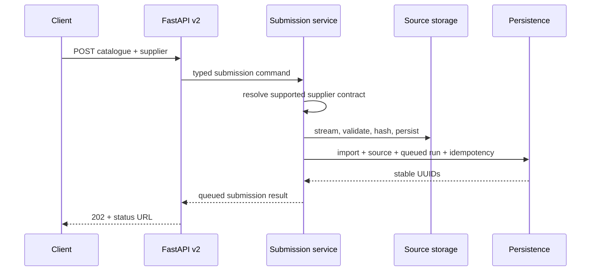

# Catalogue FastAPI Submission Boundary

This document describes the v2 HTTP boundary for supplier catalogue submissions.
The boundary records a durable source file, creates a compatibility
`CatalogueImport`, creates the canonical `CatalogueSourceDocument`, creates a
queued `IngestionRun`, and returns a stable run UUID for polling.

The request does not run OCR, extraction, raw capture, staging, mastering,
review, publication, FastAPI background tasks, or Prefect orchestration. A
queued run remains queued until a later orchestrator starts it.

## Pre-edit Audit

| Concern | Current implementation | Gap for submission boundary | Action |
|---|---|---|---|
| Router mounting | `main.py` mounts `/v1`, `/v2`, and schema-hidden unversioned v1 compatibility aliases. | v2 had no catalogue submission route. | Add v2-only catalogue submission/status routes. |
| Existing upload behavior | `/v1/catalogues/import` reads the upload, calls extraction/tagging synchronously, and best-effort persists the source file. | v2 needs quick durable registration only. | Leave v1 unchanged and add a separate v2 queued boundary. |
| Permission | Catalogue onboarding uses `require_capability("catalogue_onboard")`. | New endpoint needs the same capability. | Protect submit and status endpoints with the existing dependency. |
| File durability | v1 `_persist_upload` is best effort and filename-derived. | `202 Accepted` must mean the source file is retrievable later. | Add chunked durable storage with generated UUID path, checksum, size limit, and cleanup. |
| Compatibility import | `IngestionRun.source_document_id` still references `CatalogueImport`. | New source documents still need a legacy import row. | Create a `CatalogueImport` with `queued` status and zero item count without extraction side effects. |
| Canonical source document | `CatalogueSourceDocument` stores source UUIDs, checksum, source ref, supplier, contract, and document type. | Submission must populate this as the canonical source asset. | Create it transactionally with the queued run. |
| Ingestion run | `IngestionRun` stores run UUID and supplier-source contract identity. | `started_at` was not truthful for queued submissions when non-null. | Allow `started_at = null` and migrate old SQLite shape safely. |
| Contract selection | `resolve_supplier_contract` supports exact and supplier-only supported resolution. | HTTP input needs explicit pairing and ambiguity-safe behavior. | Accept optional `contract_id` and `contract_version`; require both or neither. |
| Supported suppliers | Runtime-supported contracts are Hill's `hills.price_list.v1` and Alfamedic `alfamedic.price_list.v1`. | Vetapet and Kangaroo remain partial/unverified technical debt. | Reject unsupported/unverified contracts at submission time. |
| Queued dispatch | No code dispatches queued runs. | Prefect is deferred. | Do not schedule work; document queued handoff. |

## HTTP Contract

### `POST /v2/catalogues/ingestions`

Accepts `multipart/form-data`:

| Field/header | Required | Meaning |
|---|---:|---|
| `file` | Yes | Supplier catalogue file. Supported extensions are `.pdf`, `.xlsx`, `.xls`, and `.csv`, subject to the resolved supplier contract source format. |
| `supplier_id` | Yes | Positive integer supplier ID. |
| `contract_id` | No | Exact supplier-source contract ID. Must be supplied with `contract_version`. |
| `contract_version` | No | Exact supplier-source contract version. Must be supplied with `contract_id`. |
| `Idempotency-Key` | No | Retry key for returning the same queued run for the same material request. |

The endpoint returns `202 Accepted` only after the source file and database rows
are durable:

```json
{
  "ingestion_run_id": "00000000-0000-4000-8000-000000000000",
  "supplier_catalogue_id": "00000000-0000-4000-8000-000000000001",
  "source_file_id": "00000000-0000-4000-8000-000000000002",
  "supplier_id": 14,
  "contract_id": "hills.price_list.v1",
  "contract_version": "v1",
  "document_type": "PRICE_LIST",
  "status": "queued",
  "submitted_at": "2026-07-23T00:00:00+00:00",
  "status_url": "/v2/catalogues/ingestions/00000000-0000-4000-8000-000000000000"
}
```

The response does not expose filesystem paths, storage credentials, internal
database primary keys, stack traces, or supplier-registry internals.

### `GET /v2/catalogues/ingestions/{run_uuid}`

Returns a safe polling payload:

```json
{
  "ingestion_run_id": "00000000-0000-4000-8000-000000000000",
  "supplier_catalogue_id": "00000000-0000-4000-8000-000000000001",
  "source_file_id": "00000000-0000-4000-8000-000000000002",
  "supplier_id": 14,
  "contract_id": "hills.price_list.v1",
  "contract_version": "v1",
  "document_type": "PRICE_LIST",
  "status": "queued",
  "submitted_at": "2026-07-23T00:00:00+00:00",
  "started_at": null,
  "completed_at": null,
  "items_extracted": null,
  "metrics": null,
  "error_summary": null
}
```

Unknown run UUIDs return `404`.

## Contract Resolution

The service resolves supplier-source contracts before writing the file.

- If `contract_id` and `contract_version` are provided, the resolver selects
  that exact supported contract and confirms it belongs to `supplier_id`.
- If neither is provided, supplier-only resolution succeeds only when exactly
  one runtime-supported contract exists for the supplier.
- If one contract field is supplied without the other, the endpoint returns
  `422`.
- Unknown, unsupported, partially verified, unverified, deprecated, or
  cross-supplier contracts are rejected.
- The resolver never selects the first registry entry by ordering and never runs
  AI document-format detection.

## Source File Durability

The service writes uploads under the configured catalogue upload root
(`CATALOGUE_UPLOAD_DIR`, default `/data/catalogue_uploads`). Storage is not based
on the untrusted original filename.

Durable writes use:

- generated `source_file_id` as the basename;
- `v2/{source_file_id}{extension}` as the persisted `source_ref`;
- a temporary `.tmp/{source_file_id}.part` file;
- chunked reads with `CATALOGUE_SUBMISSION_MAX_BYTES` enforcement;
- SHA-256 calculated while streaming;
- extension and signature checks for PDF, spreadsheet, and CSV inputs;
- sanitized original filename stored only as metadata;
- cleanup of partial files on validation, storage, or database failures.

If database persistence fails after a new file was written, the service removes
that unreferenced file before surfacing a typed persistence error. Idempotent
replays do not delete the original durable file.

## Persistence Transaction

One successful submission creates these records as one business transaction:

| Record | Purpose | Notes |
|---|---|---|
| `CatalogueImport` | Compatibility source row for current `IngestionRun.source_document_id`. | Status is `queued`, `item_count = 0`, and no `CatalogueItem` rows are created. |
| `CatalogueSourceDocument` | Canonical source asset record. | Stores supplier/source UUIDs, checksum, source ref, supplier contract ID/version, document type, and metadata. |
| `IngestionRun` | Queued ingestion attempt. | Stores stable `run_uuid`, exact supplier-source contract identity, `status = queued`, `started_at = null`, `completed_at = null`. |
| `CatalogueSubmissionIdempotency` | Durable HTTP retry record when `Idempotency-Key` is supplied. | Unique key plus material fingerprint and response snapshot. |

A run is never committed without its source rows, and a successful source row
never points to a missing newly written file.

## Idempotency

The material fingerprint contains:

- file SHA-256;
- supplier ID;
- resolved contract ID;
- resolved contract version;
- document type.

Behavior:

| Retry case | Result |
|---|---|
| No `Idempotency-Key` | A deliberate second submission creates a distinct file/source/run. |
| New key | Creates one file/source/run and stores the response snapshot. |
| Same key and same material | Returns the original response and creates no duplicate source/run. |
| Same key and different material | Returns `409 IDEMPOTENCY_CONFLICT`. |
| Concurrent duplicate key | Database uniqueness is the final guard; matching material resolves to one result, conflicting material fails. |

## Error Mapping

| Failure | HTTP status | Code |
|---|---:|---|
| Unknown supplier | `404` | `UNKNOWN_SUPPLIER` |
| Partial contract identity | `422` | `INVALID_CONTRACT_PARAMETERS` |
| Unknown or unsupported supplier contract | `422` | `UNSUPPORTED_SUPPLIER_CONTRACT` |
| Supplier-only resolution ambiguity | `409` | `AMBIGUOUS_SUPPLIER_CONTRACT` |
| Supplier/contract mismatch | `409` | `SUPPLIER_CONTRACT_MISMATCH` |
| Idempotency material conflict | `409` | `IDEMPOTENCY_CONFLICT` |
| Empty file | `400` | `EMPTY_UPLOAD` |
| Unsupported source type or signature | `415` | `UNSUPPORTED_SOURCE_TYPE` |
| File too large | `413` | `UPLOAD_TOO_LARGE` |
| Malformed filename | `400` | `MALFORMED_FILENAME` |
| Storage unavailable | `503` | `STORAGE_UNAVAILABLE` |
| Database persistence unavailable | `503` | `SUBMISSION_PERSISTENCE_UNAVAILABLE` |
| Unknown run UUID | `404` | `INGESTION_RUN_NOT_FOUND` |

Unexpected failures use the normal sanitized `500` behavior and do not expose
stack traces, SQL text, source paths, or credentials.

## Sequence



## Compatibility and Deferred Work

`/v1/catalogues/import` remains the synchronous compatibility path and still
performs extraction/review staging in the legacy tables. The v2 submission route
does not call extraction services, stage services, `BackgroundTasks`, queues, or
Prefect.

Deferred work:

- Prefect orchestration for starting queued runs;
- upload UI integration;
- adapter from orchestration into raw-capture stage services;
- status transitions from queued to running/terminal;
- HITL endpoints;
- serving-read cutover from legacy inventory reads to publication snapshots.
