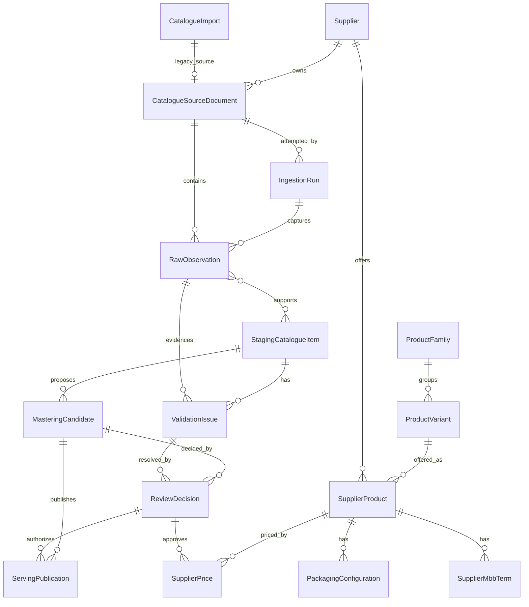

# Catalogue Logical Persistence Model

Status: implementation foundation  
Branch: `codex/catalogue-logical-persistence-model`  
Date: 2026-07-23

This document defines the durable catalogue-ingestion persistence model that backs the approved CIS-103 Pydantic contracts without making those contracts table-shaped. The boundary contracts remain authoritative for payload semantics; SQLAlchemy stores durable evidence, lifecycle state, lineage, review decisions, and publication snapshots.

This task does not wire the full upload workflow, OCR pipeline, Prefect orchestration, HITL UI, or public serving API into these new tables. Existing v1 catalogue runtime behavior remains compatibility behavior.

Implemented files:

- SQLAlchemy models: `apps/api/v2/models/catalogue_pipeline.py`
- Evolved ingestion run model: `apps/api/v2/models/ingestion_run.py`
- Contract mappers: `apps/api/services/catalogue_pipeline_persistence.py`
- Migration audit script: `apps/api/scripts/audit_catalogue_pipeline_migration.py`
- Focused tests: `apps/api/tests/test_catalogue_pipeline_persistence.py`

## Pre-Edit Audit

Remote `main` was inspected at `d7d66e18add21996e4c29a28c4a4bcfe6cbdcc87`. Open PR #1 (`ingestion-run-model`) remains open and contains a broad duplicated `apps/api/models/v2/*` model package, so it is not used as this foundation. The merged CIS-104.1 `IngestionRun` table is present at `apps/api/v2/models/ingestion_run.py` and is evolved rather than duplicated.

| Current model/table | Current meaning | Contract/domain concept | Classification | Required action |
|---|---|---|---|---|
| `Supplier` | Existing supplier master with aliases, brand links, terms, segment and sheet-import metadata. | Supplier identity for source documents, supplier products and supplier-source contract lineage. | `REUSE` | Keep integer IDs. Reference from new source documents, runs, supplier products and publications. |
| `Product` | Current canonical SKU row. It combines product-family, variant, classification and several adjacent platform fields. | Product Variant / canonical SKU; Product Family is optional enrichment and missing today. | `EXTEND` | Preserve current table as compatibility product variant. Add a separate optional product-family table for future grouping. |
| `ProductSupplier` | Current supplier-specific offer with supplier SKU/barcode, current `basic_cost`, pack/order fields and stock metadata. | Supplier Product compatibility projection. | `REPLACE_GRADUALLY` | Add normalized supplier-product, packaging, supplier-price and MBB history tables. Keep `ProductSupplier.basic_cost` as derived compatibility state. |
| `MbbTerm` | Current 0..N MBB terms using `kind` plus unrelated nullable columns and `Float`. | MBB condition plus benefit. | `REPLACE_GRADUALLY` | Keep legacy table. Add typed MBB term persistence with condition/benefit types and Decimal/Numeric values. |
| `CatalogueImport` | Uploaded source document plus supplier-detection metadata and current review status. | Catalogue source document / source asset. | `EXTEND` | Keep as legacy source document. Add a pipeline source document table linked by optional `legacy_import_id`. |
| `IngestionRun` / `catalogue_ingestion_runs` | One extraction attempt for a `CatalogueImport`, isolated from v1 runtime. Stores `contract_version` only. | Catalogue ingestion run. | `EXTEND` | Add stable UUID and exact supplier-source contract identity fields. Preserve existing integer primary key and tests. |
| `CatalogueItem` | Current review-queue row combining raw source values, parser proposals, review state and committed links. | Staging Catalogue Item compatibility queue. | `LEGACY_COMPATIBILITY_ONLY` | Do not make it the new contract store. New staging table separates raw fields, proposed fields, issue links and lineage. |
| `CatalogueCostStaging` | Narrow cost-only staging row with float cost and match confidence. | Supplier Price proposal / validation issue input. | `LEGACY_COMPATIBILITY_ONLY` | Leave as compatibility. New supplier-price proposal lives in mastering candidate and price-history tables. |
| `CatalogueAuditEvent` | Append-only free-form catalogue action audit. | Review decision / audit event. | `EXTEND` | Preserve. Add typed review-decision table with reviewer, decision, override reason and candidate linkage. |
| `ReparseBatch` | Reparse review batch over a scope. | Reprocessing attempt and staged diffs. | `OUT_OF_SCOPE` | Keep. Not a general ingestion run or mastering candidate. |
| `ReparseChange` | One staged field diff for reparse confirmation. | Narrow reviewable field proposal. | `OUT_OF_SCOPE` | Keep. Do not reuse for contract-stage persistence. |
| Current packaging fields | `Product.uom`, `Product.pack_unit`, `ProductSupplier.units_per_pack`, order increment/MOQ, `CatalogueItem.pack_size`. | Packaging Configuration. | `REPLACE_GRADUALLY` | Add structured packaging table with purchase UOM, price-basis UOM, sellable UOM, content measure, ordering terms and lineage. |
| Current review/approval fields | `CatalogueItem.review_status`, `reviewed_by`, `reviewed_at`, audit details. | Mastering Candidate and Review Decision. | `REPLACE_GRADUALLY` | Add candidate and typed review-decision tables. Parser proposals are not approved facts until a decision exists. |
| Current serving/API reads | Existing product/supplier endpoints read live `Product` and `ProductSupplier`. | Serving Item / publication snapshot. | `NEW` | Add serving publication table that only accepts approved candidate statuses and preserves lineage. Do not change current API responses yet. |
| Durable validation issue | Not present as typed, queryable persistence. | Validation Issue. | `NEW` | Add independently resolvable validation issue table. |
| Raw observation | Not first-class; source text/cells/location are scattered or absent. | Raw Observation. | `NEW` | Add immutable raw-observation table with source location and raw evidence. |
| Pipeline contract mapper | Not present. | Contract persistence boundary. | `NEW` | Add focused mapper/service outside routers. |

## Logical Entities

The implemented persistence foundation keeps these semantic layers separate:

```text
Supplier source document
  -> ingestion attempt
  -> immutable raw observation
  -> staging interpretation/proposal
  -> validation issue
  -> mastering candidate
  -> review decision
  -> approved supplier/product commercial state
  -> serving publication/snapshot
```

### ER Diagram



### Entity Definitions

| Entity | Purpose | Identity/key strategy | Lifecycle and mutability | Contract mapping |
|---|---|---|---|---|
| Catalogue Source Document | Durable source asset for one supplier catalogue file. | Integer DB PK plus unique UUIDs for `supplier_catalogue_id` and `source_file_id`; optional `legacy_import_id`. | Append/update metadata only. Source evidence is not rewritten. | `PipelineTrace.supplier_catalogue_id`, `source_file_id`; run/source lineage. |
| Catalogue Ingestion Run | One extraction attempt for one source document. | Existing integer PK plus unique `run_uuid`. | Status moves through queued/running/terminal. Retry links to parent run. | `ingestion_run_id`; supplier-source contract ID/version used by the run. |
| Raw Observation | Immutable observed text/cells at a source location. | UUID primary pipeline identity. | Append-only after insertion except narrow metadata corrections by later task. | `RawObservationV1`. |
| Staging Catalogue Item | Proposed interpretation of one or more raw observations. | UUID primary pipeline identity. | Reviewable proposal state; raw fields remain separate from typed proposed fields. | `StagingCatalogueItemV1`. |
| Validation Issue | Durable issue requiring attention or recording uncertainty. | UUID primary pipeline identity. | Open until confirmed/corrected/accepted/dismissed; resolution metadata required when resolved. | `ValidationIssueV1`. |
| Mastering Candidate | Proposed resolution into canonical and supplier-commercial concepts. | UUID primary pipeline identity. | Proposed until a review decision approves, overrides, rejects or asks for clarification. | `MasteringCandidateV1`. |
| Review Decision | Typed human/system decision over a candidate or issue. | UUID primary pipeline identity. | Append-only decision record. Overrides require reason. | Referenced from Mastering Candidate, MBB selection and validation issue resolution. |
| Product Family | Optional grouping/enrichment above canonical SKU. | Integer DB PK plus stable string key. | Mastered enrichment; optional for variants. | `product_family_id` remains nullable. |
| Product Variant | Canonical SKU identity. | Existing `Product.id` compatibility key plus stable variant key/SKU. | Mastered product identity. | `ProductVariantResolution`, `ServingItemV1.product_variant_*`. |
| Supplier Product | Supplier-specific offer of a Product Variant. | Integer DB PK plus optional legacy `ProductSupplier.id`; uniqueness by supplier/SKU/barcode where known. | Mastered supplier offer; source proposals do not overwrite it without decision. | `SupplierProductResolution`, `SupplierOffering`. |
| Packaging Configuration | Approved structured purchasing packaging. | Integer DB PK linked to supplier product and decision. | Effective-dated, history-preserving. | `PackagingConfiguration`. |
| Supplier Price | Effective-dated approved supplier cost. | Integer DB PK linked to supplier product and decision. | History-preserving; old rows get superseded, not overwritten. | `Cost`, `SupplierPriceResolution`, `ServingItemV1.current_approved_cost`. |
| Supplier MBB Term | Effective-dated typed bulk-buy condition plus benefit. | Integer DB PK plus contract MBB UUID when present. | History-preserving; multiple tiers supported. | `MbbTerm`, `MbbSelection`. |
| Serving Publication | Approved read-model snapshot safe for downstream consumption. | UUID publication identity plus publication key/version. | Append-only; current row superseded by setting `superseded_at`. | `ServingItemV1`. |

## Identity and Type Decisions

- Existing business-domain tables keep integer IDs for compatibility.
- New pipeline-stage records store UUID strings compatible with Pydantic contracts and enforce uniqueness.
- `catalogue_ingestion_runs` keeps its integer `id` and gains `run_uuid`, `supplier_source_contract_id`, `supplier_source_contract_version`, and `document_type`.
- Monetary, quantity, percentage and confidence values use SQLAlchemy `Numeric`, not `Float`.
- Currency is stored explicitly. v1 is constrained to `HKD`.
- Timezone-aware Python datetimes are serialized to ISO strings for repository compatibility with the current SQLite migration mechanism; mapper code validates awareness before persistence.
- JSON text is used intentionally for contract snapshots, raw cells, source/proposed field snapshots, source locations and variable subtype details. Lifecycle state, issue severity/status, review/publication status, price basis, MBB types and lineage keys are columns.

## Contract-To-Persistence Matrix

| Contract | Contract field/path | Persistence entity | Column/relation | Treatment | Notes |
|---|---|---|---|---|---|
| `RawObservationV1` | `contract_version` | Raw Observation | `contract_version` | normalized column | Exact literal preserved. |
| `RawObservationV1` | `raw_observation_id` | Raw Observation | `raw_observation_uuid` | normalized UUID string | Unique pipeline identity. |
| `RawObservationV1` | `ingestion_run_id` | Ingestion Run / Raw Observation | `run_uuid`, `ingestion_run_uuid` | relation by UUID | DB FK to integer run may be added when resolvable. |
| `RawObservationV1` | `supplier_catalogue_id`, `source_file_id` | Source Document / Raw Observation | UUID columns | relation/snapshot | Preserves source lineage. |
| `RawObservationV1` | `extraction_profile` | Raw Observation | profile ID/version columns | normalized columns | Historical reference, not YAML. |
| `RawObservationV1` | `source_location` | Raw Observation | `source_location_json` plus locator columns | JSON snapshot + query columns | Page/sheet/row/cell/object key are indexed where useful. |
| `RawObservationV1` | `raw_text`, `raw_cells` | Raw Observation | `raw_text`, `raw_cells_json` | column + JSON snapshot | Requires meaningful evidence. |
| `RawObservationV1` | extraction metadata/confidence | Raw Observation | method/model/confidence/captured columns | normalized columns | Confidence is `Numeric(5,4)`. |
| `StagingCatalogueItemV1` | `trace` | Staging Item | run/source/profile columns | normalized lineage | Mirrors trace for queryability. |
| `StagingCatalogueItemV1` | `catalogue_item_id` | Staging Item | `catalogue_item_uuid` | UUID string | Unique pipeline identity. |
| `StagingCatalogueItemV1` | `raw_observation_ids` | Staging Item Raw Observation link | join table | related table | Enforces at least one, same-run check in mapper. |
| `StagingCatalogueItemV1` | `raw_fields` | Staging Item | `raw_fields_json` | JSON snapshot | Source evidence strings preserved. |
| `StagingCatalogueItemV1` | `proposed_fields` | Staging Item | `proposed_fields_json` | JSON snapshot | Proposals stay separate from raw fields. |
| `StagingCatalogueItemV1` | review/issue metadata | Staging Item / Validation Issue | columns and relation | normalized + relation | Issue IDs link to durable issue rows where present. |
| `ValidationIssueV1` | identity/run/item/raw/stage/code/severity/status | Validation Issue | columns | normalized | Queryable open/blocking issues. |
| `ValidationIssueV1` | values/guidance/resolution | Validation Issue | JSON/text columns | normalized + JSON | Resolution metadata required when resolved. |
| `MasteringCandidateV1` | identity/trace/item/raw lineage | Mastering Candidate | columns and lineage JSON | normalized + snapshot | Mapper rejects missing raw/staging lineage. |
| `MasteringCandidateV1` | resolution sections | Mastering Candidate | section JSON columns | JSON snapshots | States are also queryable through review status. |
| `MasteringCandidateV1` | review status/decision | Mastering Candidate / Review Decision | columns/relation | normalized | Approved candidates require reviewer/time. |
| `MasteringCandidateV1` | supplier product/product variant/packaging/price/MBB | Mastering Candidate and commercial tables | JSON proposal + approved normalized rows | snapshot + related tables | Commercial rows are created only from approved candidates by mapper helpers. |
| `ServingItemV1` | identity/SKU/variant/supplier/cost/packaging | Serving Publication | columns + snapshot JSON | normalized + snapshot | Only approved statuses allowed. |
| `ServingItemV1` | lineage | Serving Publication | candidate/staging/raw/version columns | normalized + JSON | Supports trace from publication to raw evidence. |
| `ServingItemV1` | optional brand/categories/MBB/external mappings | Serving Publication / MBB terms | JSON snapshot / related table | snapshot | No unapproved parser proposals exposed. |
| Supplier source identity | supplier ID, contract ID/version, document type | Source Document / Ingestion Run | columns | normalized | Run records exact source-format contract used. |

## Database Constraints and Indexes

Indexes are tied to expected workflow queries:

- observations by ingestion run/source document: `raw_observations(ingestion_run_uuid)`, `raw_observations(supplier_catalogue_uuid)`;
- observations by location: page/sheet/row columns;
- staging items by run/status/review requirement;
- open blocking issues by stage/entity: `validation_issues(stage, severity, resolution_status)`;
- candidates awaiting review: `mastering_candidates(review_status)`;
- decisions by candidate/reviewer/date;
- supplier products by supplier/SKU/barcode;
- prices by supplier product and effective dates;
- active MBB terms by supplier product;
- publications by canonical SKU/supplier product/current status;
- lineage from publication to candidate/staging/raw UUIDs.

Portable `CHECK` constraints enforce non-negative money, positive quantities where present, HKD currency on approved costs, valid date ranges where both endpoints are known, content amount/UOM pairing, and current-publication flags.

## Migration and Legacy Data Treatment

The repository migration mechanism is `database.py::run_migrations()`, which executes idempotent SQLite DDL and relies on `Base.metadata.create_all()` for fresh SQLite/PostgreSQL schemas. This task keeps that mechanism and adds only additive tables/columns.

Legacy data is not silently corrected:

| Legacy row type | Treatment |
|---|---|
| `CatalogueImport` rows with filename/imported_at | Safely linkable to new source documents when a later backfill chooses to create them. |
| `CatalogueItem` rows | Compatibility-only unless raw source location and raw/proposed separation can be reconstructed. |
| `ProductSupplier.basic_cost` floats | Compatibility projection only. Do not backfill into approved supplier-price history without basis/currency/review evidence. |
| `CatalogueItem.pack_size` and `units_per_pack` | Requires review before becoming structured packaging. Content measures are not treated as sellable-unit counts. |
| Legacy `MbbTerm` rows | Requires remediation into condition+benefit semantics when type and basis are clear; otherwise review-required. |
| `CatalogueAuditEvent` rows | Useful audit evidence, but not automatically complete typed review decisions. |

The migration audit script counts current legacy rows into safe-linkable, compatibility-only and review-required buckets. It does not mutate business meaning:

```bash
cd apps/api
UV_CACHE_DIR=/tmp/uv-cache uv run --with-requirements requirements.txt \
  python scripts/audit_catalogue_pipeline_migration.py
```

## Transaction Boundaries

- Raw-observation batch: insert source/run references, all raw observations and raw-observation indexes in one transaction.
- Staging item: insert staging row and raw-observation links together; cross-run links are rejected before commit.
- Validation issue: issue creation/resolution is one transaction; resolved issues require resolver/time or note.
- Mastering decision: candidate and decision updates commit together; open blocking issues prevent approval.
- Publication: serving publication is written only after approval validation and current-publication supersession happen in one transaction.

## Current Runtime Wiring

Current `/v1/catalogues/import`, reparse services and inventory views continue to use legacy `CatalogueImport`, `CatalogueItem`, `Product`, `ProductSupplier` and legacy `MbbTerm` behavior. The new logical persistence tables and mappers are standalone foundations for the next ingestion-integration task. They are not yet emitted by upload, OCR, supplier-source runtime, FastAPI endpoints or Prefect.

## Deferred Work

- Wire upload/OCR to create source documents, ingestion runs, raw observations and staging items.
- Add explicit public upload parameters or internal transport for `contract_id` and `contract_version`.
- Build HITL APIs/UI on typed validation issues, mastering candidates and review decisions.
- Backfill legacy rows only where source evidence and review state are sufficient.
- Replace compatibility reads from `ProductSupplier.basic_cost` with supplier price history when consumer APIs are ready.
- Remediate legacy MBB rows into typed condition+benefit records.
