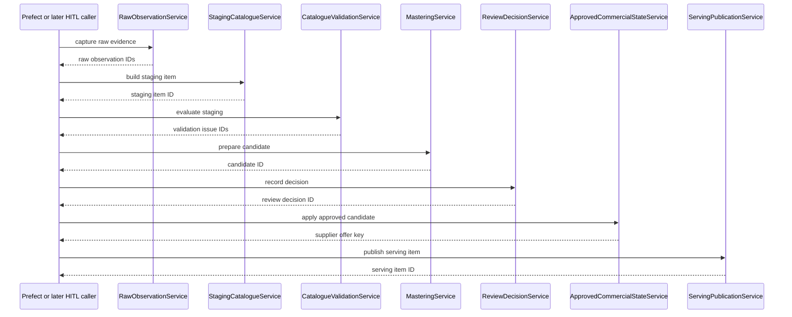

# Catalogue Pipeline Stage Services

This document defines the framework-neutral services that execute the persisted
catalogue pipeline one stage at a time. These services sit between FastAPI,
Prefect orchestration, later HITL callers and the CIS-103 Pydantic contracts
plus SQLAlchemy persistence foundation.

The services do not start the full pipeline, parse multipart requests, schedule
background jobs, or switch public read APIs to the new publication tables.

## Prerequisite Audit

| Pipeline concept | Pydantic contract | Persistence entity | Existing service | Gap/action |
|---|---|---|---|---|
| Source asset | `ExtractionProfileReference` plus supplier-source contract identity | `CatalogueSourceDocument` | Legacy upload creates `CatalogueImport`; no stage boundary service | Stage services validate run/source/contract identity before capture. |
| Ingestion run | `PipelineTrace.ingestion_run_id` | `IngestionRun` / `catalogue_ingestion_runs` | CIS-104.1 model plus v2 submission and Prefect lifecycle services | Orchestration claims queued runs and records terminal machine-ingestion state. |
| Raw Observation | `RawObservationV1` | `CatalogueRawObservation` | Mapper only | `RawObservationService.capture` creates immutable evidence records. |
| Staging Catalogue Item | `StagingCatalogueItemV1` | `CatalogueStagingItem`, `CatalogueStagingRawObservation` | Mapper only | `StagingCatalogueService.build_item` preserves raw lineage and proposals. |
| Validation Issue | `ValidationIssueV1` | `CatalogueValidationIssue`, `CatalogueReviewDecision` | Mapper only | `CatalogueValidationService` deduplicates open issues and records resolutions. |
| Mastering Candidate | `MasteringCandidateV1` | `CatalogueMasteringCandidate` | Mapper only | `MasteringService.prepare_candidate` creates reviewable proposals only from unblocked staging. |
| Review Decision | Candidate review fields plus `CatalogueReviewDecision` | `CatalogueReviewDecision`, candidate review columns | Mapper side effect only | `ReviewDecisionService.record_decision` binds decisions to one candidate revision. |
| Product Variant | `ProductVariantResolution`, `ServingItemV1.product_variant_id` | Legacy `Product` plus nullable link from `CatalogueSupplierProduct` | Legacy product APIs | Stage services require explicit SKU/name for publication and never invent a product match. |
| Supplier Offer | `SupplierProductResolution`, `SupplierOffering` | `CatalogueSupplierProduct` | Legacy `ProductSupplier` runtime | `ApprovedCommercialStateService` writes supplier-scoped offer state, distinct from Product Variant. |
| Packaging/cost/MBB | Shared `PackagingConfiguration`, `Cost`, `MbbTerm` | `CataloguePackagingConfiguration`, `CatalogueSupplierPrice`, `CatalogueSupplierMbbTerm` | Legacy flattened cost/pack fields | Approved application writes typed history, not legacy flattened rows. |
| Serving publication | `ServingItemV1` | `CatalogueServingPublication` | Mapper combined publication/application | `ServingPublicationService.publish` validates and writes immutable snapshots after application. |

Current extraction and reparse runtime still write legacy `CatalogueItem` and
legacy product/supplier rows. The stage services are callable beside that
runtime. The v2 FastAPI submission boundary records source files and queued runs
only; it does not call these stage services inline. Prefect orchestration now
invokes Raw, Staging, Validation and Mastering Candidate services after a queued
run is claimed, then stops for human review.

## Service Responsibilities

`RawObservationService.capture`

- Accepts an explicit ingestion run, source document, supplier, contract identity
  and one or more raw evidence payloads.
- Resolves the supported supplier-source contract deterministically.
- Validates run/source/supplier/contract consistency.
- Builds `RawObservationV1`, preserving raw text/cells and source location.
- Uses a deterministic run-scoped idempotency key.
- Does not create staging, validation, mastering, or publication records.

`StagingCatalogueService.build_item`

- Accepts explicit raw observation IDs plus separate raw/proposed field payloads.
- Rejects empty, duplicate, cross-run, cross-source, or cross-contract lineage.
- Builds `StagingCatalogueItemV1` and persists raw-observation lineage.
- Does not run validation or create mastering candidates implicitly.

`CatalogueValidationService.evaluate_staging`

- Reconstructs a staging contract and evaluates persistence-context/domain rules.
- Persists stable `ValidationIssueV1` records for unresolved cost basis,
  unresolved packaging semantics, and content-measure-as-count errors.
- Re-running creates no duplicate equivalent open issues.
- `resolve_issue` updates issue resolution metadata and records an auditable
  validation review decision.

`MasteringService.prepare_candidate`

- Accepts one staging item and optional explicit resolution sections.
- Rejects staging items with open blocking validation issues.
- Builds a `MasteringCandidateV1` in `PENDING_REVIEW`.
- Preserves Product Variant and Supplier Offer as separate proposals.
- Allows Product Variant resolution with `product_family_id = null`.

`ReviewDecisionService.record_decision`

- Records an explicit append-only review decision for one candidate revision.
- Updates candidate review status atomically with the decision row.
- Rejects stale candidate timestamps, unresolved blocking issues, and invalid
  override approvals.
- Repeated equivalent commands are idempotent; contradictory decisions fail.

`ApprovedCommercialStateService.apply_approved_candidate`

- Applies only `APPROVED` or `APPROVED_WITH_OVERRIDE` candidates.
- Creates or updates `CatalogueSupplierProduct` as the supplier offer.
- Adds effective-dated packaging, base cost, and MBB terms with candidate and
  review lineage.
- Supersedes prior current price/packaging/MBB state without deleting history.
- Does not publish a serving snapshot.

`ServingPublicationService.publish`

- Requires an approved candidate and already applied supplier commercial state.
- Reconstructs `ServingItemV1` from the approved candidate, supplier offer,
  current price, and current packaging.
- Validates cost-per-sellable-unit derivation before persistence.
- Writes an immutable current/superseded serving publication snapshot.
- Does not write legacy public API read tables.

## Sequence

The caller decides if and when the next service is invoked. No stage service
calls the next stage implicitly.

## Stage Matrix

| Stage | Accepted input | Durable output | May proceed when | Idempotency identity | Blocking failures |
|---|---|---|---|---|---|
| Raw capture | `CaptureRawObservationsCommand` | `CatalogueRawObservation` | Supplier contract is `SUPPORTED` and run/source identity matches | Run + source + evidence key | Unsupported contract, run/source mismatch, missing evidence/location |
| Staging | `BuildStagingItemCommand` | `CatalogueStagingItem` plus raw links | All raw observations share run/source/file/contract | Run + staging key | Empty/duplicate/cross-run lineage |
| Validation | `EvaluateStagingCommand` | `CatalogueValidationIssue` | Staging item exists | Run + item + issue code + field path | Invalid issue contract; blocker stays open until resolved |
| Mastering | `PrepareMasteringCandidateCommand` | `CatalogueMasteringCandidate` | Staging exists and has no open blocking issue | Staging item + candidate key | Blocking issues, missing staging |
| Review | `RecordReviewDecisionCommand` | `CatalogueReviewDecision` plus candidate status | Candidate is pending and revision matches | Candidate + review key | Stale revision, open blockers, invalid override |
| Commercial application | `ApplyApprovedCandidateCommand` | Supplier offer, packaging, price, MBB rows | Candidate is approved and unblocked | Candidate commercial state | Missing supplier offer identity, missing cost/packaging |
| Serving publication | `PublishServingItemCommand` | `CatalogueServingPublication` | Approved candidate has applied offer, price, and packaging | Candidate + publication key/version | Unapproved candidate, unapplied state, underived sellable cost |

## Transaction Ownership

Each service receives a SQLAlchemy `Session` and has an explicit `commit`
constructor flag. With the default `commit=True`, one public method owns one
business transaction and commits only after the contract and lifecycle transition
are durable. With `commit=False`, tests or future orchestration can group calls
inside an external transaction; the service flushes but does not commit.

Low-level mapper functions still do not commit. A failed service call raises a
typed domain error and does not mark the next stage complete.

## Idempotency and Concurrency

Stage identities are deterministic UUIDs or stable keys derived from the
upstream stage and caller-provided idempotency key. Reusing the same key with
the same material payload returns the existing output. Reusing the same key with
different material raises `IdempotencyConflict`.

Database uniqueness constraints remain the final concurrency guard. If a race
hits a unique/check constraint, the service raises `ConcurrentModification`
rather than silently duplicating output.

## Lifecycle Rules

The implemented persisted states map to the approved lifecycle as follows:

- Raw: inserted raw observation means captured.
- Staging: `PROPOSED` means eligible for validation/mastering; `NEEDS_REVIEW`
  means review or unresolved validation is present.
- Mastering: candidates begin as `PENDING_REVIEW`; review transitions may set
  `APPROVED`, `APPROVED_WITH_OVERRIDE`, `REJECTED`, or `NEEDS_CLARIFICATION`.
- Serving: a publication row starts `is_current = 1`; a later publication for
  the same key sets the older row to `is_current = 0` and `superseded_at`.

No service mutates raw evidence to match a proposal, and rejection never deletes
upstream evidence or candidate history.

## Cost, Packaging, and MBB

The services keep purchase UOM, price-basis UOM, sellable-unit UOM, content
amount/UOM, order increment, and minimum order separate. A content value such as
`30 ML` or `82 G` remains a content measure and is not used as a sellable-unit
count. If cost-per-sellable-unit cannot be derived from approved cost basis and
packaging, publication fails instead of inventing a denominator.

Supplier commercial terms are applied to `CatalogueSupplierProduct`, not to the
global Product Variant alone. MBB terms retain typed condition plus typed
benefit and candidate/review lineage.

## Product Variant and Supplier Offer

A Product Variant is the canonical inventory identity. A Supplier Offer is the
supplier-specific way that variant is purchased. The services preserve this
distinction:

- Mastering creates proposals for both sections.
- Application creates/updates supplier-offer state only after approval.
- Product Family remains optional.
- If the candidate lacks enough Product Variant or Supplier Offer identity for
  a trusted operation, the service raises a typed ambiguity error.

## Legacy Compatibility

Existing upload, extraction, catalogue review, reparse, All Inventory, and SKU
Details behavior remains unchanged. Current v1 runtime extraction still writes
legacy `CatalogueItem` rows. The new services do not replace public routes or
serving reads in this task.

## Deferred Work

- HITL API/UI for review decisions and validation issue resolution.
- Review-decision orchestration after human action.
- Runtime adapter expansion for future supported supplier extraction outputs.
- Public read cutover from legacy inventory views to `ServingItemV1`
  publications.
- Additional supplier-specific validation rules as evidence is confirmed.
