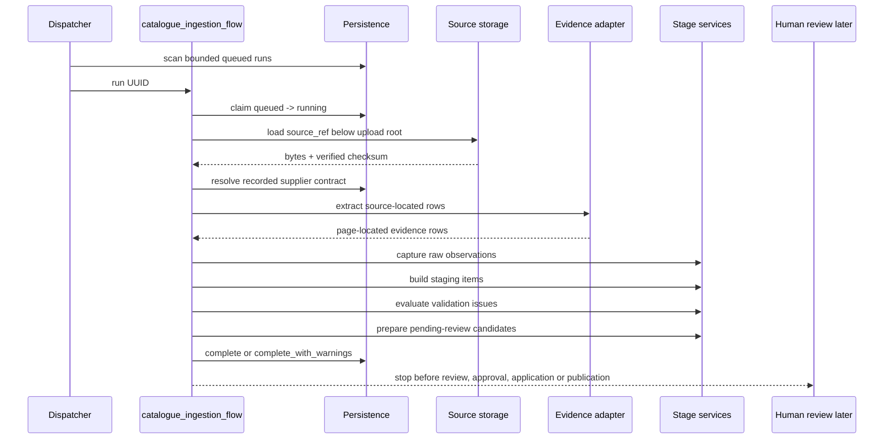

# Catalogue Prefect Orchestration

Status: implementation foundation  
Date: 2026-07-23

This document defines the Prefect orchestration boundary for v2 catalogue
ingestion. The v2 submission endpoint durably creates a queued `IngestionRun`;
this orchestration layer claims that queued run and coordinates the
machine-executable stages through Raw Observation, Staging, Validation Issue and
pending-review Mastering Candidate creation.

The flow does not approve, apply supplier commercial state, publish Serving
Items, replace the v1 synchronous import path, or make Prefect responsible for
domain semantics.

## Prerequisites Rechecked

The implementation builds on the current persistence and service foundations:

| Foundation | Current implementation | Use in orchestration |
|---|---|---|
| v2 submission boundary | `CatalogueSubmissionService` and `/v2/catalogues/ingestions` create durable source documents and queued runs. | The flow accepts only the stable run UUID returned by submission. |
| Source asset persistence | `CatalogueSourceDocument` stores source UUIDs, checksum, source ref, supplier, contract ID/version, document type and source format. | The source loader verifies path safety, file signature and SHA-256 before extraction. |
| Run lifecycle | `IngestionRun` supports `queued`, `running`, `completed`, `completed_with_warnings`, `failed` and `cancelled`; `started_at` is nullable for queued runs. | The lifecycle service atomically claims queued runs and writes truthful terminal state. |
| Supplier-source contracts | `supplier_source_contract_runtime.resolve_supplier_contract` rejects unknown, ambiguous and unsupported contracts. | Orchestration resolves the exact recorded ID/version only. |
| Stage services | `RawObservationService`, `StagingCatalogueService`, `CatalogueValidationService` and `MasteringService` are framework-neutral. | Prefect tasks call these services without importing FastAPI or leaking ORM objects between tasks. |
| v1 compatibility | `/v1/catalogues/import` still performs synchronous legacy extraction. | The Prefect path does not change v1 behavior. |

## Prefect Dependency

`prefect==3.3.7` is pinned in `apps/api/requirements.txt`.

This version is compatible with the repository's current Pydantic 2.9.x pin and
Python 3.11 Docker target while still supporting Python 3.13 in local tests.
Newer Prefect 3.4.x releases require a newer Pydantic range, so they are not
used until the backend dependency set is intentionally upgraded.

Prefect imports are confined to `apps/api/orchestration/`. Pydantic contracts,
supplier-source contracts, SQLAlchemy models, mappers, stage services and
FastAPI routers do not import Prefect.

## Flow and Task Topology

Primary flow:

```python
catalogue_ingestion_flow(*, ingestion_run_id: UUID) -> CatalogueFlowResult
```

The flow input is the public run UUID. It reloads the run, source document and
recorded supplier contract from persistence on execution. It never accepts raw
file paths, uploaded bytes, unvalidated supplier IDs, contract dictionaries or
catalogue business data as flow parameters.

Task sequence:

| Task | Responsibility | Retry policy |
|---|---|---|
| `load-and-claim-catalogue-run` | Atomically move `queued` to `running`. | No retry. Duplicate claim is a typed result. |
| `load-and-verify-catalogue-source` | Load the durable source and verify size, path safety, signature and checksum. | No retry for deterministic source errors. |
| `resolve-recorded-supplier-contract` | Resolve exact supplier contract ID/version recorded on the run. | No retry. |
| `extract-source-located-evidence` | Produce source-located row evidence. | Two retries only for transient provider/network failures. |
| `capture-raw-observations` | Persist `RawObservationV1` records through the stage service. | No retry; idempotency handles replay. |
| `build-staging-items` | Persist `StagingCatalogueItemV1` records linked to raw observations. | No retry; idempotency handles replay. |
| `evaluate-staging-items` | Persist durable validation issues. | No retry; issue keys deduplicate. |
| `prepare-pending-review-candidates` | Create pending-review mastering candidates for unblocked staging items. | No retry; blocking issues are expected business outcomes. |
| `finalize-catalogue-run` | Write terminal success or warning state. | One DB retry. |
| `record-catalogue-run-failure` | Write sanitized failure state in a fresh transaction. | One DB retry. |

No task passes a live SQLAlchemy `Session`, file handle or ORM instance across
Prefect task boundaries. Task payloads are dataclasses, UUIDs, strings, counts
and validated dictionaries.

## Sequence



## Source Loading and Checksum Verification

`load_and_verify_source_asset` is the authoritative source loader for
orchestration.

It:

- loads the run by UUID and its `CatalogueSourceDocument`;
- resolves `source_ref` beneath `CATALOGUE_UPLOAD_DIR`;
- rejects blank, absolute, traversal or root-escaping source references;
- reads in bounded chunks;
- enforces `CATALOGUE_ORCHESTRATION_MAX_SOURCE_BYTES`, default `25 MB`;
- recomputes SHA-256 and compares it with the persisted source checksum;
- checks source signatures for PDF/PDF table, spreadsheet and CSV formats;
- returns a typed source asset without exposing absolute paths.

Missing, altered, oversized, unreadable or signature-mismatched files fail the
run with sanitized operational errors. The flow never continues with unverified
bytes.

## Exact Supplier Contract Resolution

The flow resolves the supplier-source contract using only the identity persisted
on the run and source document:

- supplier ID;
- supplier-source contract ID;
- supplier-source contract version;
- document type;
- source format.

There is no supplier-only fallback in orchestration. Unknown versions,
cross-supplier mismatches, document-type mismatches, source-format mismatches,
`PARTIALLY_VERIFIED`, `UNVERIFIED` and deprecated contracts fail safely.

Runtime-supported source contracts remain:

| Supplier | Contract | Version | Source format | Runtime status |
|---|---|---:|---|---|
| Alfamedic | `alfamedic.price_list.v1` | `v1` | PDF table | Supported |
| Hill's | `hills.price_list.v1` | `v1` | PDF table | Supported |
| Vetapet | `vetapet.vet_price_list.v1` and related declarations | `v1` | PDF table | Not runtime selectable |
| KPN/Kangaroo | Kangaroo declarations | `v1` | PDF table | Not runtime selectable; technical debt |

No supplier contract was promoted by this orchestration task.

## Source-Evidence Extraction Adapter

The orchestration path adds a source-evidence adapter instead of weakening the
Raw Observation contract for legacy extraction output.

For current PDF/PDF-table contracts, the adapter processes one verified PDF page
at a time and calls the existing extraction service with that page payload. The
page number is therefore the 1-based page index from the processing boundary,
not an unverified model claim.

Each emitted `ExtractedCatalogueRow` contains:

- `source_location` with page number and a stable source object key;
- raw text and optional raw cells;
- extracted field values;
- extraction method;
- model/provider metadata where applicable;
- Decimal-compatible confidence only when supplied;
- row warnings.

The adapter rejects legacy stub/error placeholders, empty extractions,
malformed rows and rows without truthful raw evidence. It does not fabricate
page numbers, row numbers, bounding boxes, raw text, price basis, packaging
quantities, sellable-unit counts or MBB semantics.

Hill's and Alfamedic have focused adapter coverage proving page evidence,
Decimal confidence conversion, raw text preservation, content-measure separation
and unresolved MBB preservation.

## Raw to Staging to Validation to Candidate

The adapter converts source evidence into existing stage service commands:

| Stage | Adapter behavior |
|---|---|
| Raw Observation | Preserves raw text/cells, source location, extraction method, model metadata and confidence. Deterministic idempotency key is run scoped by the stage service. |
| Staging Item | Keeps printed source strings in `StagingRawFields` and typed interpretations in `ProposedCatalogueFields`. |
| Validation Issue | Calls `CatalogueValidationService.evaluate_staging`; durable issue rows are created or reused. |
| Mastering Candidate | Calls `MasteringService.prepare_candidate` only for staging items with no open blocking issue. Candidates stay `PENDING_REVIEW`. |

Ambiguous operational semantics stay unresolved. A raw cost like `By Quote`
creates a blocking validation issue and prevents candidate preparation. Raw MBB
text is kept as evidence unless a typed condition and benefit can be proved.

## Human Review Stop Point

The automatic boundary stops after pending-review candidate creation. It does
not:

- resolve validation issues;
- invent reviewer identities;
- record approval or rejection;
- apply supplier commercial state;
- create or supersede supplier prices, packaging or MBB terms;
- publish Serving Items;
- treat extraction confidence as approval.

`completed` means the machine ingestion attempt produced truthful staging and
candidate output without operational warnings. `completed_with_warnings` means
rows were rejected, blocking validation issues remain, durable warnings were
created, or other non-fatal issues need attention. Business approval remains a
separate human-review workflow.

## Run Lifecycle and Concurrency

`catalogue_run_lifecycle.py` owns orchestration transitions:

```text
queued -> running
running -> completed
running -> completed_with_warnings
running -> failed
queued/running -> cancelled
```

Starting a run uses an atomic database compare-and-set:

```sql
UPDATE catalogue_ingestion_runs
SET status = 'running', started_at = :now, completed_at = NULL
WHERE run_uuid = :run_uuid AND status = 'queued'
```

Only one worker can claim a queued run. A second worker receives a typed
duplicate-claim result, and terminal replay returns the existing terminal
metrics. Database constraints and stage-service idempotency remain the final
guard against duplicate raw, staging, issue and candidate rows.

Failures are recorded in a fresh transaction where possible. Failure summaries
are sanitized and exclude stack traces, credentials, absolute storage paths,
SQL text and catalogue contents.

Stale `running` recovery is intentionally documented rather than automatically
implemented in this task. An operator can inspect the run and either rerun after
resetting it to `queued` through a controlled maintenance action or mark it
`failed`/`cancelled` with a recorded reason. A future recovery command can add a
time-based stale-running policy.

## Dispatch and Reconciliation

The repository uses a scheduled/looping reconciler pattern. The dispatcher:

- queries a bounded, deterministic batch of queued runs;
- invokes `catalogue_ingestion_flow` with each run UUID;
- avoids terminal runs;
- relies on the atomic claim for duplicate-dispatch safety;
- can run as a one-shot command or as a long-running worker loop.

Commands:

```bash
cd apps/api
python -m orchestration.catalogue_dispatch --batch-size 10
python -m orchestration.catalogue_dispatch --loop --interval-seconds 30 --batch-size 10
```

The current Docker Compose file includes a dormant worker profile:

```bash
docker compose --profile catalogue-worker up -d catalogue-worker
```

This worker runs the dispatcher loop from the same API image and shares the
same data volume for source files. No Prefect server is exposed publicly by this
change.

## Environment Variables

| Variable | Default | Purpose |
|---|---|---|
| `CATALOGUE_UPLOAD_DIR` | `/data/catalogue_uploads` | Root used by submission and orchestration source loading. |
| `CATALOGUE_ORCHESTRATION_MAX_SOURCE_BYTES` | `26214400` | Max verified source size for orchestration reads. |
| `CATALOGUE_DISPATCH_BATCH_SIZE` | `10` | Docker worker bounded queued-run batch size. |
| `CATALOGUE_DISPATCH_INTERVAL_SECONDS` | `30` | Docker worker loop sleep between dispatch scans. |
| `ANTHROPIC_API_KEY` | unset | Required only when the extraction provider is used. Disabled extraction is treated as non-truthful evidence in the Prefect path. |
| `PREFECT_API_URL` | unset | Optional Prefect server URL. Tests and local one-shot flows can run with Prefect's local/ephemeral mode. |

## Retry Classification

Retries are bounded and narrow:

- retry: transient extraction provider/network/rate-limit style failures;
- retry: transient DB failures on finalize/failure-record tasks;
- no retry: unsupported contracts, contract mismatch, checksum mismatch,
  malformed source, missing evidence, deterministic Pydantic failures, invalid
  lifecycle transitions, ambiguous packaging/cost/MBB semantics.

Warnings and validation issues are business outcomes, not infrastructure
failures.

## SQLite and PostgreSQL Notes

SQLite remains supported for local development and the current deployment. The
claim query uses a single conditional `UPDATE`, which SQLite executes
atomically for one database file. PostgreSQL remains compatible with the same
compare-and-set pattern and can later add stronger worker visibility using row
locks if needed.

The worker and API must share the configured upload root. For SQLite, only one
database file should be used by both containers. For PostgreSQL, both processes
must point to the same `DATABASE_URL`.

## Existing Compatibility

- `/v1/catalogues/import` remains synchronous and legacy-table based.
- `/v2/catalogues/ingestions` still returns after durable submission only.
- The v2 status endpoint reads the run state written by orchestration.
- Stage services stay framework-neutral.
- Public inventory reads are not cut over to serving publications here.

## Deferred Work

- HITL endpoints and UI for validation issues and mastering candidates.
- Review-decision orchestration after human action.
- Applying approved candidates to supplier commercial state.
- Serving publication and public read cutover.
- Explicit stale-running recovery command.
- Rich Prefect deployment manifests if a managed/self-hosted Prefect server is
  adopted.
- Spreadsheet/CSV orchestration support when those supplier formats become
  runtime-supported with row-level evidence.
- KPN/Kangaroo supplier-source contract completion after supplier ownership and
  row-evidence debt is resolved.
